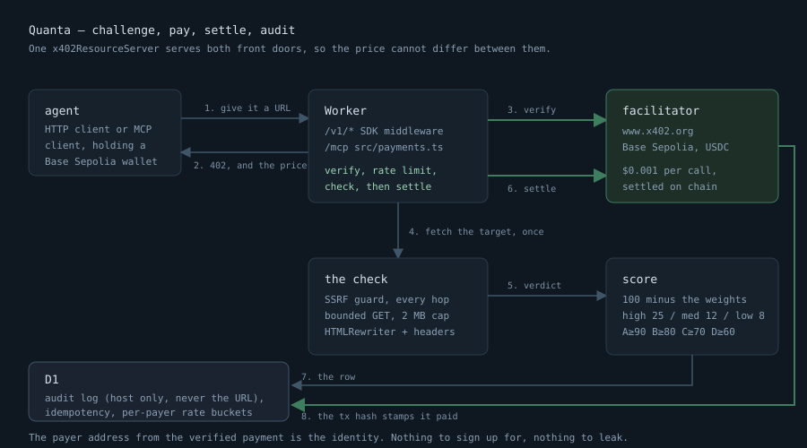

# Quanta

**An AI agent hands Quanta a URL, pays a tenth of a cent, and gets back a structured
verdict on whether that website is broken.** No account. No API key. The payment is the login.



Try it in 30 seconds (no wallet needed):

```
curl -s https://quanta.themeknock.net/demo | jq .verdict
curl -i https://quanta.themeknock.net/v1/check?url=https://example.com   # → 402 + price + where to pay
```

Or let an agent find it: MCP endpoint at `https://quanta.themeknock.net/mcp`
(tools: `check_url`, `check_https`, `check_headers`).

**The one decision I'd defend:** the payment is the identity. Rate limits, idempotency and the
audit log key off the verified payer address. There is nothing to sign up for and nothing to leak.

**What it is not:** it does not render JavaScript, it settles on Base Sepolia testnet, and it
cannot read a certificate's expiry date — Cloudflare Workers exposes no certificate object, so
it reports whether the certificate *verified* instead of pretending to have read one. Details
in [Honest limits](#honest-limits).

---

## What the two commands above actually print

The free demo, run 16 Sep 2026:

```json
{
  "score": 68,
  "grade": "D",
  "issues": [
    { "code": "NO_HSTS", "severity": "low" },
    { "code": "NO_CSP", "severity": "low" },
    { "code": "NO_X_FRAME_OPTIONS", "severity": "low" },
    { "code": "NO_X_CONTENT_TYPE_OPTIONS", "severity": "low" }
  ]
}
```

The paid route, unpaid. The price is in a header, not the body — that is x402 v2:

```
HTTP/2 402
content-type: application/json
cache-control: no-store
payment-required: eyJ4NDAyVmVyc2lvbiI6MiwiZXJyb3IiOiJQYXltZW50IHJlcXVpcmVkIiwi...
```

Decoded, that header is the challenge:

```json
{ "scheme": "exact",
  "network": "eip155:84532",
  "amount": "1000",
  "asset": "0x036CbD53842c5426634e7929541eC2318f3dCF7e",
  "payTo": "0x759E7D2569435Ec1E7BFCb495C355a417630ec85",
  "maxTimeoutSeconds": 300 }
```

`1000` is atomic units of testnet USDC: $0.001.

---

## How it works

`agent → challenge → pay → settle → audit`, and the diagram above is the whole of it.

The part worth reading the code for is that **there is one `x402ResourceServer`** ([`src/x402.ts`](src/x402.ts)),
shared by both front doors. The HTTP routes are gated by the SDK's Hono middleware; the MCP
tools are gated by [`src/payments.ts`](src/payments.ts). Same instance, so the price, the rails
and the payment requirements cannot drift apart between the two.

Verification and settlement are deliberately **two steps**, in this order:

```
decode → match against what we actually sell → verify with the facilitator
       → rate limit → run the check → settle
```

A caller who is over their rate limit is refused *before* their money moves. That ordering is
the difference between a paywall and a toll booth that charges you to be turned away.

---

## MCP

Stateless: no Durable Object, no session. Every call carries its own payment, so there is
nothing to remember between requests — which is also why it runs on the free plan.

Claude Desktop, via `mcp-remote`:

```json
{
  "mcpServers": {
    "quanta": {
      "command": "npx",
      "args": ["-y", "mcp-remote", "https://quanta.themeknock.net/mcp"]
    }
  }
}
```

Call a tool with no `payment` argument and it quotes you a price instead of working:

```json
{"x402":"payment_required","accepts":[{"network":"eip155:84532","amount":"1000"}]}
```

Call it with a made-up one and it refuses. Presence is not proof:

```json
{"x402":"payment_invalid","reason":"malformed_payment_payload"}
```

That refusal is asserted by a test, not by a promise — see
[`test/mcp.test.ts`](test/mcp.test.ts), *"REFUSES payment='bogus' — presence is not proof"*,
which also asserts the target site was never fetched. A refusal that still did the work is not
a refusal.

---

## API

Three paid routes, one payment each. All return JSON.

| Route | Takes | Returns |
| --- | --- | --- |
| `GET /v1/check` | `url` | `target`, `http`, `https`, `headers`, `html`, `verdict`, `_meta` |
| `GET /v1/https` | `host` | `target`, `https` (verified, `upgrades_from_http`, `hsts`), `_meta` |
| `GET /v1/headers` | `url` | `target`, `http`, `headers`, `_meta` |

Free: `/` (what this is), `/health`, `/demo`, `/bot`, `/internal/usage`, `/mcp`.

**The verdict is arithmetic**, not a judgement call: 100, minus 25 for each high-severity issue,
12 for each medium, 8 for each low, floored at 0. A≥90, B≥80, C≥70, D≥60, else F. The issue
catalogue is [`src/checks/verdict.ts`](src/checks/verdict.ts) and it is the whole list — there
is no hidden scoring.

Two behaviours worth knowing:

* **A 403 or 429 is reported as `BOT_PROTECTION_SUSPECTED` (medium), not as a broken site.**
  The site may serve a browser perfectly well; we are not a browser, and saying "your site is
  down" when it refused *our* user agent would be a lie.
* **`Idempotency-Key` is scoped to the verified payer.** The same key with a different request
  is a `409`, not a silently wrong cached answer.

---

## Honest limits

* **No JavaScript.** `html.checked` is always `raw_html_only`. A title injected by a framework
  at runtime is reported as missing, and the field name says so rather than the README.
* **No certificate fields.** The Workers runtime exposes no peer certificate, and it blocks raw
  TCP to Cloudflare IP ranges, so a userland TLS handshake is not available either. `/v1/https`
  reports whether the certificate *verified the way a browser judges it*, whether `http://`
  upgrades, and whether HSTS is set. Expiry and issuer are not reported, because they cannot be
  read. A timeout is never dressed up as a bad certificate.
* **Testnet.** Settlement is Base Sepolia. Nothing here moves real money.
* **2 MB and 5 hops.** Bodies are read to 2 MB then truncated (and the response says
  `truncated_2mb`); redirect chains are followed 5 hops then stop (and the response says
  `REDIRECT_CHAIN_TRUNCATED`).
* **It cannot check its own zone.** This Worker is served from a Custom Domain on
  `themeknock.net`, and a Worker subrequest to another hostname on its own zone loops and times
  out. `/demo` therefore walks its allowlist and names any host that did not answer, rather than
  returning a 502 and calling it a verdict.
* **One page, on request.** Quanta follows no links and queues nothing. See `/bot`.

---

## Numbers

Every number below comes from [`scripts/stats.ts`](scripts/stats.ts) reading the live D1 audit
log. None of them is typed by hand.

```
$ npm run stats
quanta stats (remote) - run 2026-09-16
  calls logged        6
  paid calls          0
  unique payers       0
  duration p50 / p95  10000 ms / 10577 ms
  idempotent replays  0 (0.0%)
  no verdict returned 0 (0.0%)
```

Read that honestly: it is the day it went live. `paid calls 0` means no real settlement has
happened yet — that needs a funded Base Sepolia wallet, and Circle's faucet has a bot check a
human has to clear. The p50 is dominated by the same-zone timeout described above.

---

## Running it

```
npm install
npm test          # 70 tests, inside workerd, against a stub facilitator, metering ON
npm run typecheck
npm run dev       # wrangler dev --local
npm run stats     # the numbers above, from the live database
```

Tests run in the real runtime via `@cloudflare/vitest-pool-workers`, so HTMLRewriter, D1 and
`crypto.subtle` are the real implementations rather than mocks. The facilitator is stubbed —
that is the only thing that is — so the suite never touches the network and can still assert
that a bogus payment is refused and a good one settles.

To record the README GIF: `vhs docs/demo.tape` with `npm run dev` already running.

---

## Cost

$0/month. Cloudflare Workers free tier (100k requests/day, 10 ms CPU per invocation) and D1
free tier (5 GB, 5M row reads/day). There is no server, no container and no database instance
to keep warm.

---

## Sibling

[playwright-sentinel](https://github.com/themeknock/playwright-sentinel) is the browser-level
version of the same instinct: Quanta answers "is this page broken" from the wire in
milliseconds, without a browser; Sentinel drives a real browser when the answer needs one.
